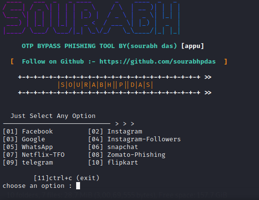

# Disclamer

Any actions and or activities related to flora tool is solely your responsibility. The misuse of this toolkit can result in criminal charges brought against the persons in question. The contributors will not be held responsible in the event any criminal charges be brought against any individuals misusing this toolkit to break the law.

This toolkit contains materials that can be potentially damaging or dangerous for social media. Refer to the laws in your province/country before accessing, using,or in any other way utilizing this in a wrong way.

This Tool is made for educational purposes only. Do not attempt to violate the law with anything contained here. If this is your intention, then Get the hell out of here!

It only demonstrates "how phishing works". You shall not misuse the information to gain unauthorized access to someones social media. However you may try out this at your own risk.


## 🚀 About Me
I'm a free time tool creator...

  
# Hi, I'm Sourabh p das! 👋

## Screenshots



## Run Locally

Clone the project

```bash
  git clone https://github.com/Sourabhpdas/flora.git
```

Go to the project directory

```bash
  cd flora
```

Install dependencies

```bash
  ./flora.sh
```

  
## Contributing

Contributions are always welcome!

See `contributing.md` for ways to get started.

Please adhere to this project's `code of conduct`.

  
## follow on instagram

[click to follow](https://instagram.com/sourabhdasp?utm_medium=copy_link)

  
## Tech Stack

**Client:** vivek,sanu,hydra

**Server:** Node

  
